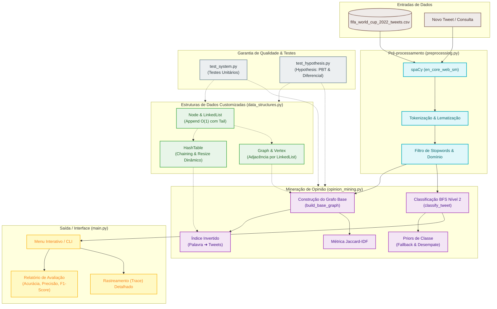

# Análise de Sentimento com Grafos PLN (Copa do Mundo de 2022)


Este repositório contém a implementação de um sistema de mineração de opinião/análise de sentimento baseado em propagação em grafos utilizando dados de tweets da Copa do Mundo FIFA de 2022 (`fifa_world_cup_2022_tweets.csv`).

O projeto foi construído utilizando estruturas de dados customizadas (Lista Encadeada, Tabela Hash e Grafo) sem o uso de bibliotecas de estruturas de dados de alto nível do Python, servindo como projeto prático para a disciplina de **Estruturas de Dados 2 (EDA2)**.

---

## 🗺️ Arquitetura do Sistema

Abaixo é apresentada a arquitetura do projeto e o fluxo de processamento de dados:



---

## 🛠️ Requisitos e Instalação

Antes de rodar o programa, certifique-se de que possui o **Python 3** instalado e obtenha as dependências necessárias, especialmente a biblioteca **spaCy** e o modelo de processamento de linguagem natural correspondente.

### 1. Clonar o Repositório
Navegue até a pasta do projeto:
```bash
cd EDA2-2026.1-AnaliseDeSentimento-Grupo08
```

### 2. Instalar Dependências
Instale as dependências listadas no `requirements.txt`:
```bash
pip install -r requirements.txt
```

### 3. Baixar o Modelo de Língua Inglesa do spaCy
O projeto faz o pré-processamento dos tweets em inglês. Para isso, baixe o modelo compacto:
```bash
python -m spacy download en_core_web_sm
```

---

## 🚀 Como Rodar o Programa

O programa possui duas formas principais de execução a partir do script `main.py`.

### 1. Menu Interativo (Avaliação Geral ou Consultas Manuais)
Para abrir o menu interativo com opções de execução:
```bash
python main.py
```
Ao executar este comando, o programa carregará os tweets e exibirá o seguinte menu no terminal:
* **Opção 1 (Avaliação Geral):** Divide o dataset em treino (construção do grafo base) e teste, gerando métricas detalhadas de avaliação como *Acurácia*, *Precisão*, *Recall* e *F1-Score* para cada classe (positivo, negativo, neutro). É possível escolher o limiar (threshold) de palavras compartilhadas necessário para conectar tweets.
* **Opção 2 (Modo Interativo):** Permite que você digite frases/tweets de forma livre no terminal para classificar o sentimento e ver o caminho de propagação detalhado (passo a passo do algoritmo BFS Nível 2 no Grafo).
* **Opção 3 (Sair):** Finaliza a execução do programa.

### 2. Consulta Direta via Argumentos de Linha de Comando
Você também pode classificar um texto diretamente sem passar pelo menu de opções, passando o texto desejado como argumento na inicialização do script:
```bash
python main.py "I love this match, it was a fantastic victory!"
```
Isso construirá o grafo base e imprimirá um rastreamento detalhado (*Trace*) com os pesos calculados das palavras úteis, vizinhos de nível 1 e 2 alcançados no grafo e o cálculo final da pontuação de sentimento.

---

## 💡 Algoritmos e Detalhes de Implementação

### 1. Construção do Grafo com Métrica Jaccard-IDF
Em vez de uma similaridade Jaccard comum, a similaridade entre dois tweets $A$ e $B$ é ponderada pelo **IDF (Inverse Document Frequency)** de suas palavras úteis compartilhadas:

$$\text{Similaridade}(A, B) = \frac{\sum_{w \in A \cap B} \text{IDF}(w)}{\sum_{w \in A \cup B} \text{IDF}(w)}$$

Isso assegura que palavras raras e com maior carga semântica influenciem mais a conexão entre os tweets do que palavras comuns que escaparam do filtro de stopwords.

### 2. Propagação de Sentimento BFS Nível 2
A classificação de um novo tweet é feita através de propagação de sentimento no grafo base em dois níveis:
- **Nível 1 (Vizinhos Diretos):** Contribuem diretamente com o peso Jaccard-IDF para a classe de sentimento do vizinho.
- **Nível 2 (Vizinhos Indiretos):** A contribuição é calculada com atenuação e normalização pelo grau do vizinho direto:
  $$\text{Contribuição}_{L2} = 0.5 \times \left(\frac{w_1}{\max w_1}\right) \times \left(\frac{w_{1 \to 2}}{\text{grau}(v_{L1})}\right)$$
- **Fallback (Prior de Classe):** Em caso de empate ou ausência de conexões com o grafo base, o classificador utiliza a probabilidade a priori de cada classe extraída no treino.

---

## 🧪 Como Executar os Testes

O projeto conta com uma robusta suíte de testes.

### 1. Testes Unitários Clássicos
Testam individualmente o comportamento das estruturas customizadas e os algoritmos:
```bash
python -m unittest test_system.py
```

### 2. Testes de Propriedade e Diferenciais (Hypothesis)
Validam a robustez das estruturas contra entradas aleatórias e comparam a corretude da `HashTable` customizada com o dicionário nativo do Python (Differential Testing):
```bash
python -m unittest test_hypothesis.py
```

---

## 📁 Estrutura do Projeto

### 🌳 Árvore de Diretórios
```text
EDA2-2026.1-AnaliseDeSentimento-Grupo08/
├── 📁 .github/                         # Workflows do GitHub Actions para integração contínua (CI)
├── 📄 .gitignore                       # Regras de arquivos e pastas ignorados pelo Git
├── 📄 LICENSE                          # Licença do projeto (MIT)
├── 📄 README.md                        # Documentação principal do repositório
├── 📄 requirements.txt                 # Dependências de bibliotecas de execução
├── 📊 fifa_world_cup_2022_tweets.csv   # Dataset de tweets sobre a Copa de 2022
├── 📊 Apresentação de Estrutura de Dados.pptx # Slides de apresentação do projeto
├── 💻 main.py                          # CLI principal e interface de interação
├── 📦 data_structures.py               # Estruturas de dados personalizadas (TADs)
├── ⚙️ preprocessing.py                 # Pipeline de processamento NLP com spaCy
├── 🧠 opinion_mining.py                 # Core do algoritmo de grafo e BFS
├── 🧪 test_system.py                   # Testes unitários do sistema
└── 🧪 test_hypothesis.py               # Testes de propriedade com Hypothesis
```

### 📋 Detalhes dos Componentes

| Arquivo / Diretório | Descrição | Principais Componentes | Detalhes Técnicos |
| :--- | :--- | :--- | :--- |
| 💻 [main.py](./main.py) | Ponto de entrada do programa. Gerencia a CLI e exibe relatórios de execução. | `main()`, `run_evaluation()`, `interactive_trace()` | Menus interativos de terminal e processamento de argumentos CLI. |
| 📦 [data_structures.py](./data_structures.py) | Implementação manual de todas as estruturas de dados necessárias para o projeto. | `Node`, `LinkedList`, `HashTable`, `Vertex`, `Graph` | Lista de adjacência, tabela hash com encadeamento e redimensionamento dinâmico. |
| ⚙️ [preprocessing.py](./preprocessing.py) | Módulo responsável pela limpeza e normalização do texto bruto dos tweets. | `preprocess_tweet()`, `DOMAIN_STOPWORDS` | spaCy (`en_core_web_sm`) para lematização rápida com remoção de ruídos. |
| 🧠 [opinion_mining.py](./opinion_mining.py) | Concentra a inteligência de processamento de grafos e a busca por índice invertido. | `build_base_graph()`, `classify_tweet()` | Grafo de similaridade Jaccard-IDF, índice invertido e propagação BFS Nível 2. |
| 🧪 [test_system.py](./test_system.py) | Testes unitários clássicos para validar o comportamento esperado de cada componente. | `TestDataStructures`, `TestPreprocessing`, `TestSentimentSystem` | Execução via `unittest` padrão do Python. |
| 🧪 [test_hypothesis.py](./test_hypothesis.py) | Testes de robustez focados em encontrar falhas sob dados inesperados. | `TestHypothesisLinkedList`, `TestHypothesisHashTable`, `TestHypothesisGraph` | Biblioteca Hypothesis para testes baseados em propriedades e testes diferenciais. |
| 📊 [Apresentação... .pptx](./Apresentação%20de%20Estrutura%20de%20Dados.pptx) | Apresentação em slides do projeto para avaliação acadêmica. | - | Arquivo contendo detalhes do design, complexidade de algoritmos e resultados obtidos. |
| 📊 [fifa_..._tweets.csv](./fifa_world_cup_2022_tweets.csv) | Dataset contendo os tweets coletados durante a Copa do Mundo de 2022. | - | Base de dados contendo tweets classificados como positivo, negativo ou neutro. |
| 📄 [requirements.txt](./requirements.txt) | Arquivo de dependências necessárias para instalar as bibliotecas do projeto. | - | Declaração de pacotes externos (`spacy`, `hypothesis`). |